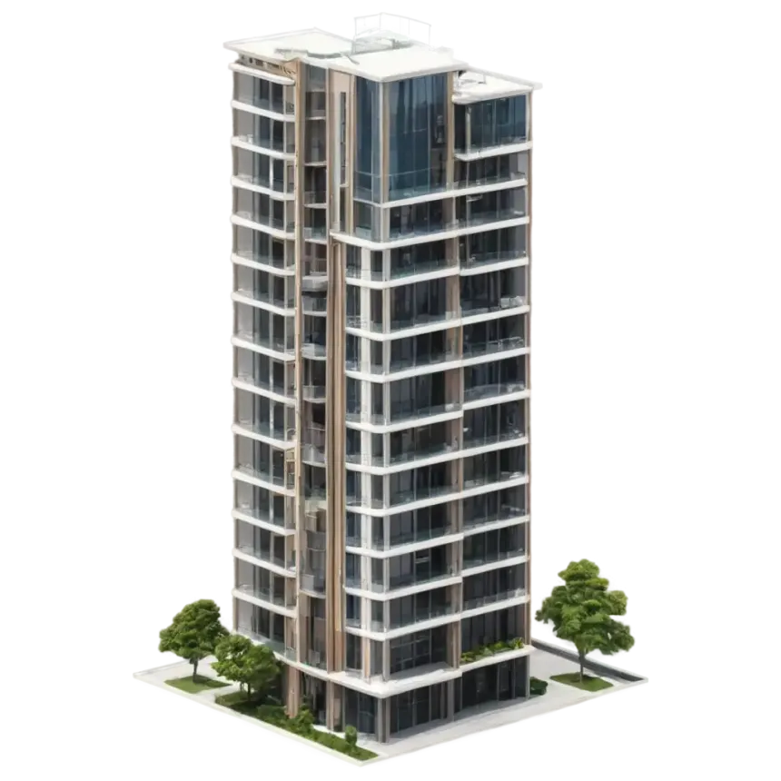

<!-- PROJECT LOGO -->

  

  <h3 align="center">🏠 HDB BTO Calculator</h3>

  

    Very simple but informative calculator for your BTO finances!
  

<!-- TABLE OF CONTENTS -->

  
Table of Contents

  <ol>
    <li>
      <a href="#about-the-project">About The Project</a>
      <ul>
        <li><a href="#built-with">Built With</a></li>
      </ul>
    </li>
    <li>
      <a href="#running-locally">Running Locally</a>
    </li>
    <li><a href="#roadmap">Roadmap</a></li>
    <li><a href="#acknowledgments">Acknowledgments</a></li>
  </ol>

<!-- ABOUT THE PROJECT -->
## About The Project

[![Product Name Screen Shot][product-screenshot]](https://hdb-calc.vercel.app/)

I created this HDB BTO calculator because I felt it would be much more useful to know **how much we need to pay upfront** during both the **signing of the lease** and the **collection of keys**.

Here's why:
* 💰 **Signing of Lease**: Knowing the amount due at this stage helps determine whether we can actually afford the flat. If we can't cover the initial downpayment, it likely means the flat is beyond our budget.
* 🗝️ **Collection of Keys**: Seeing how much is due here helps with **better financial planning**. It gives us a clear savings goal to work towards before we collect the keys.

This project started as a simple way for me to explore **HTML, JavaScript, and CSS**, but I soon realised it could be genuinely helpful for others too, so I decided to share it!

(<a href="#readme-top">back to top</a>)

### Built With

This section should list any major frameworks/libraries used to bootstrap your project. Leave any add-ons/plugins for the acknowledgements section. Here are a few examples.

* [![Javascript][Javascript]][Javascript-url]
* [![Html][Html]][Html-url]
* [![Css][Css]][Css-url]

(<a href="#readme-top">back to top</a>)

<!-- GETTING STARTED -->
## Getting Started

Simply visit this website and enter your budget! https://hdb-calc.vercel.app/

### Running Locally

To run this project on your local machine:

1. Clone or download the repository.
2. Open the `index.html` file in any modern web browser (e.g. Chrome, Firefox, Edge).

That's it — no installations or build tools required!

(<a href="#readme-top">back to top</a>)

<!-- ROADMAP -->
## Roadmap

- [x] Add sources to calculations
- [ ] Add recommended savings per month for downpayment during keys collection

(<a href="#readme-top">back to top</a>)

<!-- ACKNOWLEDGMENTS -->
## Acknowledgments

Resources that I would like to credit!

* [Font Awesome](https://fontawesome.com)
* [MDN Web Docs](https://developer.mozilla.org/en-US/)

(<a href="#readme-top">back to top</a>)

<!-- MARKDOWN LINKS & IMAGES -->
<!-- https://www.markdownguide.org/basic-syntax/#reference-style-links -->
[contributors-shield]: https://img.shields.io/github/contributors/othneildrew/Best-README-Template.svg?style=for-the-badge
[contributors-url]: https://github.com/othneildrew/Best-README-Template/graphs/contributors
[forks-shield]: https://img.shields.io/github/forks/othneildrew/Best-README-Template.svg?style=for-the-badge
[forks-url]: https://github.com/othneildrew/Best-README-Template/network/members
[stars-shield]: https://img.shields.io/github/stars/othneildrew/Best-README-Template.svg?style=for-the-badge
[stars-url]: https://github.com/othneildrew/Best-README-Template/stargazers
[issues-shield]: https://img.shields.io/github/issues/othneildrew/Best-README-Template.svg?style=for-the-badge
[issues-url]: https://github.com/othneildrew/Best-README-Template/issues
[license-shield]: https://img.shields.io/github/license/othneildrew/Best-README-Template.svg?style=for-the-badge
[license-url]: https://github.com/othneildrew/Best-README-Template/blob/master/LICENSE.txt
[linkedin-shield]: https://img.shields.io/badge/-LinkedIn-black.svg?style=for-the-badge&logo=linkedin&colorB=555
[linkedin-url]: https://linkedin.com/in/othneildrew
[product-screenshot]: images/product.jpg
[Next.js]: https://img.shields.io/badge/next.js-000000?style=for-the-badge&logo=nextdotjs&logoColor=white
[Next-url]: https://nextjs.org/
[React.js]: https://img.shields.io/badge/React-20232A?style=for-the-badge&logo=react&logoColor=61DAFB
[React-url]: https://reactjs.org/
[Vue.js]: https://img.shields.io/badge/Vue.js-35495E?style=for-the-badge&logo=vuedotjs&logoColor=4FC08D
[Vue-url]: https://vuejs.org/
[Angular.io]: https://img.shields.io/badge/Angular-DD0031?style=for-the-badge&logo=angular&logoColor=white
[Angular-url]: https://angular.io/
[Svelte.dev]: https://img.shields.io/badge/Svelte-4A4A55?style=for-the-badge&logo=svelte&logoColor=FF3E00
[Svelte-url]: https://svelte.dev/
[Laravel.com]: https://img.shields.io/badge/Laravel-FF2D20?style=for-the-badge&logo=laravel&logoColor=white
[Laravel-url]: https://laravel.com
[Bootstrap.com]: https://img.shields.io/badge/Bootstrap-563D7C?style=for-the-badge&logo=bootstrap&logoColor=white
[Bootstrap-url]: https://getbootstrap.com
[JQuery.com]: https://img.shields.io/badge/jQuery-0769AD?style=for-the-badge&logo=jquery&logoColor=white
[JQuery-url]: https://jquery.com 
[Javascript]: https://img.shields.io/badge/javascript-%23F7DF1E?style=for-the-badge&logo=JavaScript&logoColor=white
[Javascript-url]: https://developer.mozilla.org/en-US/docs/Web/JavaScript
[Html]: https://img.shields.io/badge/html5-%23E34F26?style=for-the-badge&logo=html5&logoColor=white
[Html-url]: https://developer.mozilla.org/en-US/docs/Web/HTML
[Css]: https://img.shields.io/badge/css-%23663399?style=for-the-badge&logo=css&logoColor=white
[Css-url]: https://developer.mozilla.org/en-US/docs/Web/CSS
